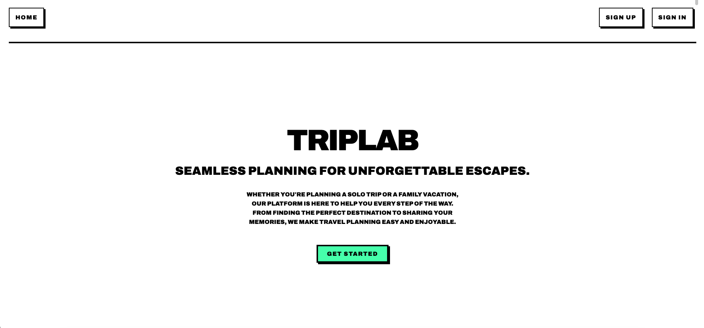

# TripLab

#### Seamless planning for unforgettable escapes.

## Description
TripLab is a collaborative travel planning platform designed to make organizing your next adventure simple and seamless. Whether you're mapping out a weekend getaway or a bucket-list journey with friends, TripLab brings your plans together in one easy-to-use space.

## Quick Links
* **GitHub repo: Front-end** can be found [here](https://github.com/JadAoun1/travel-companion-frontend).
* **GitHub repo: Back-end** can be found [here](https://github.com/JadAoun1/travel-companion-backend).
* **Deployed project** link can be found [here](https://triplabapp.netlify.app/).

## Works Cited
* **[`cors` npm package documentation](https://www.npmjs.com/package/cors#configuration-options)**: Referenced for configuring the CORS middleware options, including setting specific allowed `origin`s, `methods`, `allowedHeaders`, `credentials`, and handling preflight requests (`optionsSuccessStatus`) to enable secure communication between the frontend and the backend API.
* **[MDN Web Docs: Cross-Origin Resource Sharing (CORS)](https://developer.mozilla.org/en-US/docs/Web/HTTP/CORS)**: Provided fundamental understanding of the CORS mechanism, preflight requests (OPTIONS method), and the HTTP headers (`Access-Control-Allow-Origin`, etc.) that the `cors` middleware manages.
* **Google Gemini**: Assisted in sample implementation of CORS backend in server.js.
